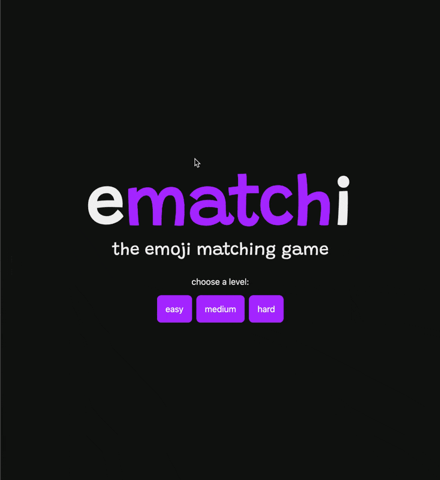

# Emachi - Emoji Memory Game

This is a Svelte project by Rich Harris (creator of Svelte) from the Svelte Fundamantals Course on Fronend Masters.

## Project Setup

1. Clone the project
2. Run `npm install`
3. Run `npm run dev`

## Project Description

This is a memory game where you have to match the emojis. The game has 3 levels of difficulty. The game is built using Svelte.

## Project Features

1. 3 levels of difficulty ( Easy, Medium, Hard - affecting time, kind and the number of emojis)
2. Timer with pause and resume functionality.
3. Svelte Animations
4. The most important feature... Confetti for the Winners 🎉

## Project Demo

[Emachi - Emoji Memory Game](https://emachi-fem-svelte.netlify.app/)

## Preview

